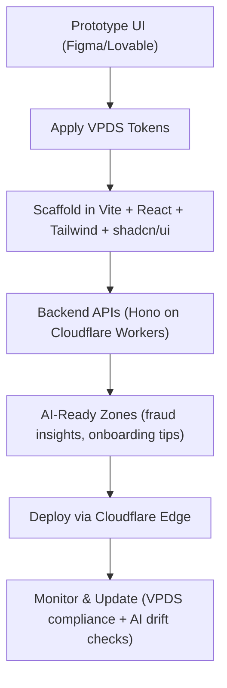

## Introduction

The **Visa Product Design System (VPDS)** provides a robust foundation for building secure, accessible, and brand-consistent experiences. But when layered with **AI-powered features**—like predictive fraud insights, self-service customer support, or intelligent onboarding flows—the design challenge shifts.  

AI brings new considerations: adaptive content zones, explainability requirements, and real-time interactions. This article covers how to **integrate AI components into VPDS-driven interfaces**, maintain compliance and usability, and leverage **Cloudflare-based deployment** to move prototypes into production. Expect actionable patterns for balancing innovation with the **trust and clarity required in payments**.  

## From Prototype to Production

Prototyping tools like **Figma Make** or **Lovable** allow rapid iteration of adaptive UIs. But production demands guardrails. By combining:  

- **VPDS tokens** (color, typography, spacing, accessibility)  
- **Vite + React + Tailwind + shadcn/ui** (frontend scaffolding)  
- **Hono APIs on Cloudflare Workers** (edge-native backend)  
- **AI-Ready Zones** (controlled areas for dynamic messaging)  

…teams can experiment freely in design while enforcing brand and compliance standards in code.  

## Why VPDS Matters in AI-Driven UI

VPDS ensures **visual and functional consistency** across all touchpoints, static or AI-generated.  

- **Design tokens** guarantee AI-generated messages render correctly.  
- **Accessibility patterns** keep adaptive content usable for all audiences.  
- **Trust components** (alerts, banners, modals) standardize how sensitive AI insights appear.  

Anchoring adaptive UIs in VPDS prevents “design drift” between AI experimentation and production readiness.  

## Example: AI-Driven UI Component

```tsx
// Predictive Fraud Alert Banner
import { Alert } from 'vpds-ui';

<Alert type="warning" title="Potential Fraud Detected">
  Our AI system flagged this transaction for review. Please verify.
</Alert>
```

> [!TIP]  
> Use clear, accessible alert components for AI-driven notifications. Always provide context and next steps.  

## Accessibility & Compliance Checklist

| Feature         | Requirement   | VPDS Support  |
|-----------------|--------------|---------------|
| Color Contrast  | WCAG AA      | ✅ Yes        |
| Keyboard Nav    | Required     | ✅ Yes        |
| Screen Reader   | ARIA labels  | ✅ Yes        |
| Audit Trail     | Logging      | ⚙️ Customizable |

> [!WARNING]  
> Never deploy AI-driven UI features without accessibility and compliance validation.  

## Workflow: VPDS + Cloudflare Integration



## JSON Example: AI-Ready Zone with VPDS

```json
{
  "component": "RiskAlertPanel",
  "vpds_tokens": {
    "color": "vpds-color-red-600",
    "font": "vpds-font-body-bold",
    "spacing": "vpds-spacing-sm"
  },
  "ai_ready_zone": {
    "id": "adaptive_message",
    "constraints": {
      "character_limit": 160,
      "must_use_vpds_tokens": true,
      "explainability_required": true
    }
  },
  "compliance": {
    "accessibility": true,
    "pci_safe": true
  }
}
```

This keeps AI-driven copy consistent with brand rules, readable, and compliant.  

## Image Example

  

## Deployment on Cloudflare

By deploying with **Cloudflare Workers** and **static-first routing**, teams gain:  
- **Global reach** – AI recommendations and UI updates at the edge.  
- **Security** – PCI-sensitive logic isolated at the Worker layer.  
- **Scalability** – Seamless routing and caching for merchants worldwide.  

With **Wrangler**, frontend assets and backend APIs stay separated but work in sync, keeping builds maintainable and secure.  

## Conclusion

Designing AI-ready interfaces requires more than adding dynamic elements—it’s about building **trustworthy, compliant, and adaptive experiences**.  

The formula:  
- **Flexible prototyping** with modern tools.  
- **VPDS enforcement** to guarantee brand consistency.  
- **Cloudflare deployment** for speed, reach, and reliability.  

Together, these enable payment and fintech teams to innovate with AI while upholding Visa’s standards of clarity and trust.  

> [!CAUTION]  
> All AI-driven adaptivity must be **tested, monitored, and audited continuously**. VPDS compliance, accessibility standards, and PCI safeguards remain non-negotiable. AI is powerful—but only when paired with robust guardrails.

