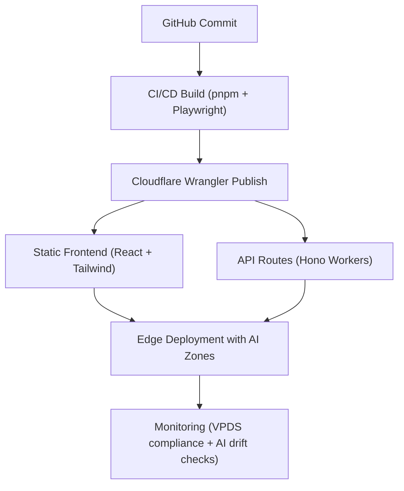

## Purpose  
This guide provides **hands-on reference patterns, schemas, and workflows** for designing and deploying **AI-ready interfaces** that meet **Visa Product Design System (VPDS)** standards.  

By combining:  
- **VPDS** (design tokens, accessibility, compliance)  
- **React + Tailwind + shadcn/ui** (modern frontend scaffolding)  
- **Hono APIs on Cloudflare Workers** (edge-native backend)  
- **AI-Ready Zones** (structured adaptive content)  

…teams can build UIs that are adaptive, secure, and production-ready.  

## Section 1: Tooling Setup  

### Recommended Tech Stack  
- **Frontend**: React, Tailwind, shadcn/ui  
- **Backend**: Hono (TypeScript API framework) on Cloudflare Workers  
- **Design System**: VPDS (https://design.visa.com)  
- **Testing**: Playwright for UI & API regression testing  
- **CI/CD**: GitHub Actions + Cloudflare Wrangler  
- **Package Manager**: pnpm (workspaces optional)  

### Commands  

```bash
# Create project
pnpm create vite my-ui-app --template react-ts
cd my-ui-app

# Install UI frameworks
pnpm install tailwindcss @tailwindcss/forms @tailwindcss/typography
pnpm install @radix-ui/react-icons shadcn/ui

# Install backend + worker types
pnpm install hono @cloudflare/workers-types

# Init tailwind
npx tailwindcss init -p
```

## Section 2: Prototyping Workflow  

**Workflow Steps:**  
1. **Prototype UI** in Figma Make / Lovable.  
   - Focus on flow (e.g., onboarding, fraud alerts, payment form).  
2. **Apply VPDS Tokens** (colors, spacing, typography).  
3. **Export Components → React** with shadcn/ui wrappers.  
4. **Scaffold Frontend** with Vite + Tailwind.  
5. **Integrate Backend APIs** with Hono Workers.  
6. **Add AI-Ready Zones** for controlled adaptivity.  

📌 *Tip: Keep VPDS parity checks at every stage—tokens must match system defaults before pushing to GitHub.* 

## Section 3: AI-Ready Patterns  

### Example 1: VPDS Alert Component  

```tsx
import { Alert } from 'vpds-ui';

<Alert type="warning" title="Potential Fraud Detected">
  Our AI system flagged this transaction for review. Please verify.
</Alert>
```

➡️ *AI provides the message, but layout, tone, and style remain VPDS-controlled.*  

### Example 2: Adaptive Onboarding Tip  

```json
{
  "component": "OnboardingTip",
  "vpds_tokens": {
    "color": "vpds-color-blue-500",
    "font": "vpds-font-body",
    "spacing": "vpds-spacing-md"
  },
  "ai_ready_zone": {
    "id": "adaptive_tip",
    "constraints": {
      "character_limit": 120,
      "must_use_vpds_tokens": true,
      "tone": "friendly"
    }
  },
  "compliance": {
    "accessibility": true,
    "pci_safe": true,
    "explainability": "required"
  }
}
```

➡️ This structure ensures AI-driven copy stays **short, friendly, and VPDS-compliant**.  

### Example 3: Risk Dashboard Widget  

```tsx
<Card className="vpds-card">
  <CardHeader>
    <CardTitle>AI Risk Insights</CardTitle>
  </CardHeader>
  <CardContent>
    <p className="vpds-text-body">
      Transactions flagged in last 24 hours: <strong>12</strong>
    </p>
    <div id="ai_zone">
      {/* AI populates insight message here */}
    </div>
  </CardContent>
</Card>
```

➡️ AI enhances the insight panel but **cannot override the VPDS layout or typography**.  

## Section 4: Deployment Workflow (Cloudflare)  

### CI/CD Flow  



### Wrangler Config Example (`wrangler.toml`)  

```toml
name = "vpds-ai-ui"
main = "src/api/index.ts"
compatibility_date = "2025-09-01"

[site]
bucket = "./dist"
entry-point = "workers-site"

[vars]
ENVIRONMENT = "production"
```

## Section 5: Monitoring & Updating  

### Automated Tests with Playwright  

```ts
import { test, expect } from '@playwright/test';

test('Fraud alert renders with VPDS tokens', async ({ page }) => {
  await page.goto('/dashboard');
  const alert = page.locator('[role="alert"]');
  await expect(alert).toHaveClass(/vpds-alert-warning/);
  await expect(alert).toContainText('Potential Fraud Detected');
});
```

### Checklist  
- ✅ **Accessibility**: Test WCAG AA contrast + ARIA labels.  
- ✅ **Audit Logs**: Capture AI-driven UI messages.  
- ✅ **Drift Detection**: Compare AI outputs vs. VPDS tokens.  
- ✅ **CI Validation**: Playwright tests per commit.  
- ✅ **Review Cycle**: Quarterly compliance review.  

## Section 6: Real-World Scenarios  

- **Fraud Review Dashboard** → AI flags unusual transactions but alerts use VPDS templates.  
- **Onboarding Flow** → AI provides adaptive tips but constrained by VPDS tone & tokens.  
- **Developer Portal** → AI enhances docs search but outputs rendered in VPDS info panels.  

## Section 7: Key Takeaways  

- **VPDS** ensures **trust + consistency**.  
- **Cloudflare Workers + Hono** = global, secure backend.  
- **React + Tailwind + shadcn/ui** = fast, compliant frontend scaffolding.  
- **AI-Ready Zones** give AI room to adapt while respecting compliance.  
- **Monitoring** ensures AI stays on-track over time.  

⚠️ **Caution**:  
This guide provides **patterns, not guarantees**. Every AI-ready UI must undergo **continuous testing, accessibility validation, and compliance checks** before production rollout.  

## Conclusion

System instructions are the backbone of reliable AI in payments. With schemas, clear boundaries, and continuous monitoring, teams can move from unpredictable “black box” answers to auditable and trusted outputs.

